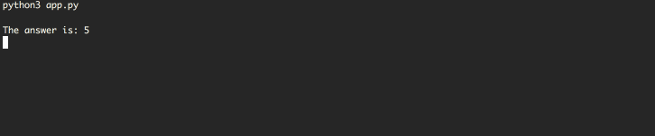

# Trivia

Simple Trivia Game for your terminal

> Notes for reviewers:
> - My goal was to focus on implementation and structuring the program to be flexible, with isolated functionality to be able to easily upgrade/update/extend features. \
For example, the way the trivia displayed can be easily changed with any graphics lib or whatever way you want, the only constraint is to keep methods named the same, so the game class can recognize them and send message to render. As a demonstration, there is a Curses renderer class (Which probably not stable but shows how renderers can be swapped)
> - I didn't focus on UIUX this time. You can check my Behance for some visual aesthetics though :) 
> - But I encourage you to check out commit history to have a better sense of my development process :) 

## Usage
Dependencies: `python3.7+`, `pytest==6.1.0`, `readchar==2.0.1`

Install dependencies
```bash
pip3 install -r requirements.txt
```
Run
```bash
python3 app.py
```


- You can also add custom trivias in JSON format to the `asset` folder and run the game.
The app will cutch all JSONs from the folder, check them to be a valid format for the game and add them up.
- Note that if JSON is not valid it will be just skipped. To check the reason JSON is not valid write `True` for `asset_debug` in `src/config.py` file:
```python
debug=False
asset_debug=True
```

To run tests use
```bash
pytest -v tests
```

> Note: Please make sure your terminal width is large enough to avoid visual bugs

### The Game
__Key Controlls__ 
- To chose an answer just press desired number
- When success or correct answer is displayed - press any key to continue
- press `q` to exit
> Escape doesn't work on some OS systems for unknown reason. It seems to be `readchar` module issue. `q` always works

__Gameplay__
- Questions are shuffled.
- Options to choose are shuffled
- If there is multiple trivias in assets - trivia picked rundomly
- The faster you answer - the higher is score

